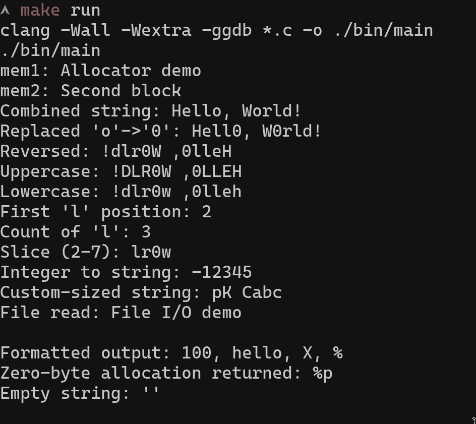

# Custom C Standard Library Implementation
### 0. Demonstration
Given this code :
```c
int main()
{

    char *mem1 = (char *)my_allocate(32);
    char *mem2 = (char *)my_allocate(64);
    if (mem1 && mem2)
    {
        sprintf(mem1, "Allocator demo");
        sprintf(mem2, "Second block");
        my_printf("mem1: %s\nmem2: %s\n", mem1, mem2);
    }
    my_free(mem1);
    my_free(mem2);

    MyString s1 = my_new_string("Hello");
    MyString s2 = my_new_string("World");
    MyString s3 = my_copy_string(&s1);
    my_append_literal(&s1, ", ");
    my_append_string(&s1, &s2);
    my_insert_char(&s1, '!', s1.size);
    my_printf("Combined string: %S\n", &s1);

    my_replace_char(&s1, 'o', '0');
    my_printf("Replaced 'o'->'0': %S\n", &s1);

    my_reverse_string(&s1);
    my_printf("Reversed: %S\n", &s1);

    my_make_uppercase(&s1);
    my_printf("Uppercase: %S\n", &s1);

    my_make_lowercase(&s1);
    my_printf("Lowercase: %S\n", &s1);

    int pos = my_find_first_occ_character(&s1, 'l');
    my_printf("First 'l' position: %d\n", pos);

    int count = my_count_character(&s1, 'l');
    my_printf("Count of 'l': %d\n", count);

    MyString slice = my_slicing(&s1, 2, 7);
    my_printf("Slice (2-7): %S\n", &slice);

    MyString int_str = my_int_to_string(-12345);
    my_printf("Integer to string: %S\n", &int_str);

    my_destroy_string(&s1);
    my_destroy_string(&s2);
    my_destroy_string(&s3);
    my_destroy_string(&slice);
    my_destroy_string(&int_str);

    MyString custom = my_allocate_custom_size(5, 20);
    my_append_literal(&custom, "abc");
    my_printf("Custom-sized string: %S\n", &custom);
    my_destroy_string(&custom);

    MyFile *file = myfopen("example.txt", "w+");
    if (file)
    {
        write(file->fd, "File I/O demo\n", 14);
        lseek(file->fd, 0, SEEK_SET);
        MyString file_content = myfread(file, 14);
        my_printf("File read: %S\n", &file_content);
        my_destroy_string(&file_content);
        close(file->fd);
        free(file);
    }

    my_printf("Formatted output: %d, %s, %c, %%\n", 100, "hello", 'X');

    void *zero_alloc = my_allocate(0);
    my_printf("Zero-byte allocation returned: %p\n", zero_alloc);
    my_free(zero_alloc);

    MyString empty = my_new_string("");
    my_printf("Empty string: '%S'\n", &empty);
    my_destroy_string(&empty);

    return 0;
}
````
It outputs 
<div style="text-align: center;">
  
</div>


### 1. General information

-   **Name of the project**: Custom C Standard Library
-   **Type of the project**: Learning, Expermientation and Personal
-   **Main Language(s) of the project**: C
-   **Goal of this project**: The goal of this project was to gain a deeper understanding of low-level systems programming by implementing my own versions of several key components from the C standard library. I wanted to see what it takes to manage memory, strings, and file I/O from scratch.
-   **Scope of this project**: This project includes four main components: a dynamic memory allocator (`my_allocate`/`my_free`), a comprehensive dynamic string library (`MyString`), a simplified version of `printf` (`my_printf`), and a basic file I/O wrapper (`myfopen`/`myfread`).
-   **Why**: Why not curse C with OOP
-   **Compatibility**: This project is written in C and relies on POSIX/UNIX-like system calls for memory allocation (`sbrk`) and file operations (`open`, `read`, `write`, `lseek`). It should compile and run on Linux and macOS. It requires a C compiler like `clang` or `gcc`, and the `make` utility to build.

### 2. Project

This project is a collection of C modules, each designed to replicate the functionality of a part of the C standard library. I focused on building each piece from basic principles.

**Dynamic Memory Allocator (`my_allocater`)**
I implemented a heap memory allocator to manage memory manually. The core idea is to maintain a doubly linked list of free memory chunks.
- When `my_allocate` is called, it searches this list using a "First Fit" strategy to find a free chunk that is large enough.
- If a suitable chunk is found, it may be split into two: one part for the user's request and a smaller, new free chunk with the remaining space. The allocated chunk is then removed from the free list.
- If no suitable free chunk is available, I make a system call to the operating system using `sbrk` to request more memory from the heap.
- `my_free` takes a user pointer, calculates the location of its metadata header, and adds the entire chunk back to the free list.

**Dynamic String Library (`my_string`)**
To overcome the limitations of fixed-size `char` arrays, I built a `MyString` struct. This struct tracks a pointer to the character data, its current size, and its allocated capacity. This allows the string to grow automatically when new data is appended. I implemented a wide range of common string manipulation functions, such as creating, destroying, appending, reversing, slicing, and changing case.

**Formatted Printing (`my_printf`)**
I created a simplified version of the standard `printf` function. My implementation parses the format string and uses C's variadic arguments (`va_list`) to process a variable number of inputs. It supports common format specifiers like `%d`, `%s`, `%c`, and `%%`. I also added a custom `%S` specifier to print my own `MyString` objects directly. The final formatted string is built using my `MyString` library and then written to standard output using the `write` system call.

**File I/O (`my_file_io`)**
This module serves as a wrapper around low-level UNIX file descriptor operations. My `myfopen` function translates the familiar mode strings ("r", "w+", "a", etc.) into the correct flags required by the `open` system call. The `myfread` function reads data from a file descriptor into a buffer, creating a `MyString` object to hold the file's contents for the user.

### 3. How to run the project :

You will need `make` and a C compiler like `clang` or `gcc` installed on your system.

1.  Navigate to the `src` directory in your terminal:
    ```sh
    cd src
    ```

2.  To compile and run the main demonstration (`main.c`), use the following command:
    ```sh
    make run
    ```
    This command will first compile all the `.c` files into an executable named `main` inside the `bin` directory, and then immediately execute it.

3.  If you only want to compile the program without running it, you can simply run:
    ```sh
    make
    ```

4.  To compile the program with debugging symbols and start a `gdb` session, use:
    ```sh
    make debug
    ```
